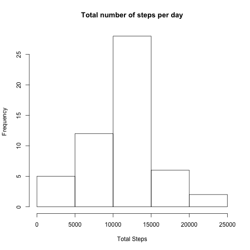
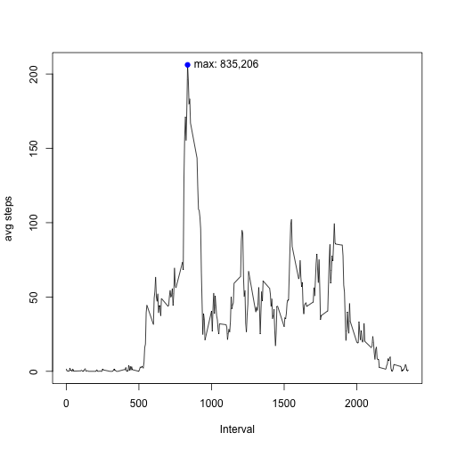
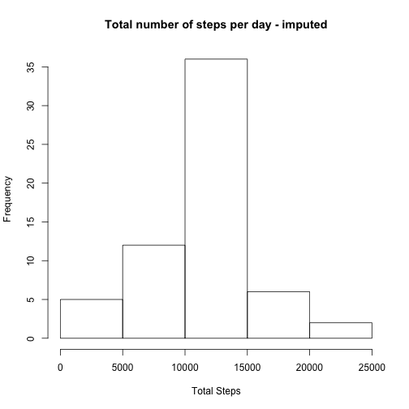
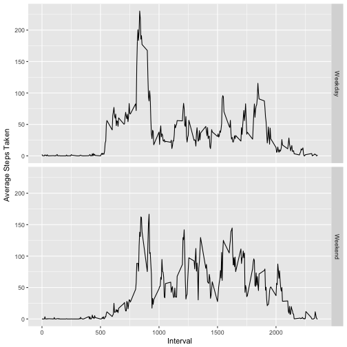

# PA1_template.rmd


#### set the global options

```r
library(knitr)
opts_chunk$set(echo = TRUE)
```

#### get the source data for processing. data is stored locally

```r
setwd("/Users/boopathi/Datascience/R/assignments/rmarkdown")
rawdata <- read.csv("activity.csv")
```

#### check the data 

```r
summary(rawdata)
```

```
##      steps                date          interval     
##  Min.   :  0.00   2012-10-01:  288   Min.   :   0.0  
##  1st Qu.:  0.00   2012-10-02:  288   1st Qu.: 588.8  
##  Median :  0.00   2012-10-03:  288   Median :1177.5  
##  Mean   : 37.38   2012-10-04:  288   Mean   :1177.5  
##  3rd Qu.: 12.00   2012-10-05:  288   3rd Qu.:1766.2  
##  Max.   :806.00   2012-10-06:  288   Max.   :2355.0  
##  NA's   :2304     (Other)   :15840
```

```r
dim(rawdata)
```

```
## [1] 17568     3
```

```r
str(rawdata)
```

```
## 'data.frame':	17568 obs. of  3 variables:
##  $ steps   : int  NA NA NA NA NA NA NA NA NA NA ...
##  $ date    : Factor w/ 61 levels "2012-10-01","2012-10-02",..: 1 1 1 1 1 1 1 1 1 1 ...
##  $ interval: int  0 5 10 15 20 25 30 35 40 45 ...
```

#### clean the data

```r
activity <- rawdata #for now dont remove NAs
activity$date <- as.Date(activity$date)
```

#### summarize the data


#### plot the histogram

```r
hist(actsum$totalSteps, xlab = "Total Steps", main = "Total number of steps per day")
```



#### mean and median from Summary

```r
summary(actsum$totalSteps)
```

```
##    Min. 1st Qu.  Median    Mean 3rd Qu.    Max.    NA's 
##      41    8841   10765   10766   13294   21194       8
```

#### avg number of stpes based on time interval and max of avg

```r
actsum2 <- rawdata %>% group_by(interval) %>%
    summarise(avgSteps = mean(na.omit(steps)))
plot(actsum2$interval, actsum2$avgSteps, type = 'l', xlab = "Interval", ylab = "avg steps")
maxval <- actsum2[which(actsum2$avgSteps == max(actsum2$avgSteps)),]
points(maxval, type="p", pch = 19, col = "blue")
text(maxval, labels = paste0("max", ": ", maxval[,1], ",", round(maxval[2])), pos = 4)
```



#### imupting data
##### using mean of interval

```r
rawdata$tempint <- as.character(rawdata$interval)
actsum3 <- rawdata %>% 
    group_by(tempint) %>%
    summarise(meanSteps = as.integer(mean(na.omit(steps)))) #calcualtes mean by intervals
rawdata <- merge(rawdata, actsum3, by.x = "interval", by.y = "tempint") #add new Steps to rawdata
rawdata$newSteps <- if_else(is.na(rawdata$steps), as.integer(rawdata$meanSteps), rawdata$steps) #use mean where stpes is NA
```


#### summarize the data, with the imputed data


#### plot the histogram

```r
hist(actsum4$totalStepsNew, xlab = "Total Steps", main = "Total number of steps per day - imputed")
```



#### mean and median total number of steps taken per day

```r
#before imputing
summary(actsum$totalSteps)
```

```
##    Min. 1st Qu.  Median    Mean 3rd Qu.    Max.    NA's 
##      41    8841   10765   10766   13294   21194       8
```

```r
#after imputing
summary(actsum4$totalStepsNew)
```

```
##    Min. 1st Qu.  Median    Mean 3rd Qu.    Max. 
##      41    9819   10641   10750   12811   21194
```

#### activity paterns by weekdays vs weekends

```r
rawdata$date <- as.Date(rawdata$date)
rawdata$day <- weekdays(rawdata$date, abbreviate = T)
rawdata$weekdayind <- as.factor(ifelse(rawdata$day %in% c("Sat","Sun"), "Weekend","Weekday"))

actsum5 <- rawdata %>% 
    group_by(weekdayind,interval) %>%
    summarise(meanNewSteps = mean(newSteps))

library(ggplot2)

p <- ggplot(data = actsum5, aes(interval, meanNewSteps)) #base plot
p <- p + geom_line() # add line
p <- p + facet_grid(weekdayind ~.) # add facets
p <- p + xlab("Interval") + ylab("Average Steps") 
plot(p)
```




